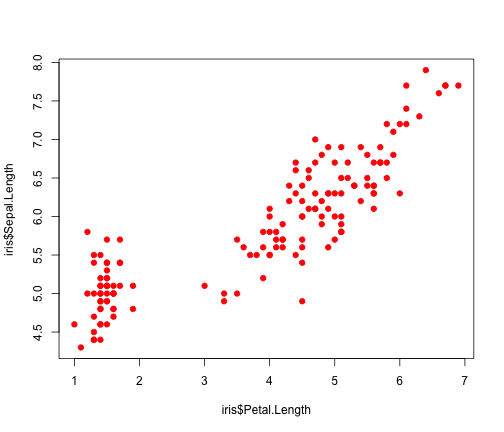
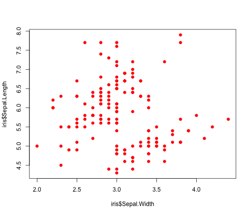
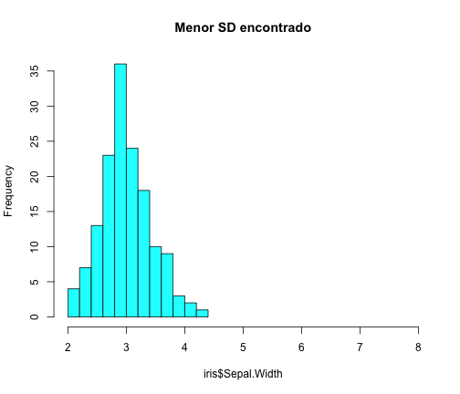
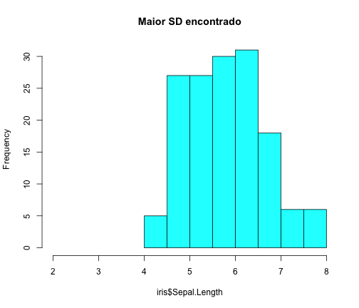
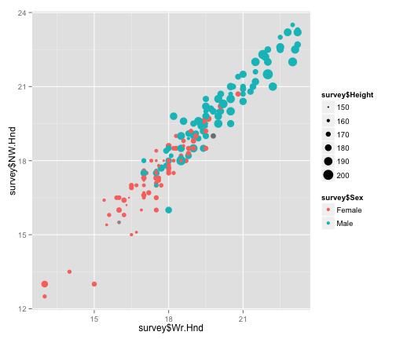
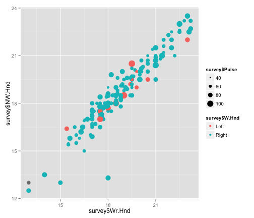
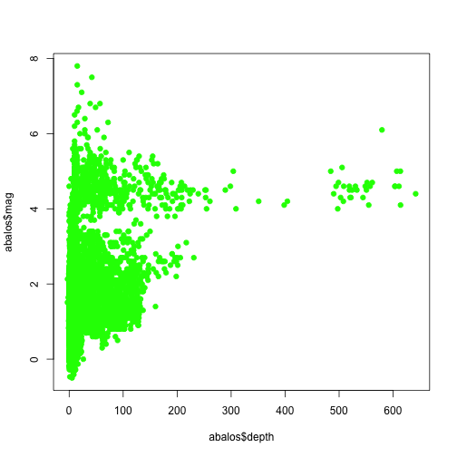

Aula 01
========================================================

Exercício 1
-----------

* Faça a carga do dataset iris.
* Exclua o atributo Species do dataset.


```r
data(iris)
iris$Species <- NULL
```

* Calcule a correlação entre os atributos restantes.


```r
cor(iris)
```

```
##              Sepal.Length Sepal.Width Petal.Length Petal.Width
## Sepal.Length    1.0000000  -0.1175698    0.8717538   0.8179411
## Sepal.Width    -0.1175698   1.0000000   -0.4284401  -0.3661259
## Petal.Length    0.8717538  -0.4284401    1.0000000   0.9628654
## Petal.Width     0.8179411  -0.3661259    0.9628654   1.0000000
```

* Imprima gráficos que demonstram a correlação positiva alta no caso de alguns atributos.


```r
plot(iris$Petal.Length, iris$Sepal.Length, pch=19, col='red')
```

 

* Imprima gráficos que demonstram a não correlação entre atributos.


```r
plot(iris$Sepal.Width, iris$Sepal.Length, pch=19, col='red')
```

 

* Calcule o desvio padrão dos atributos. Para aquele atributo com maior desvio padrão e para aquele atributo com menor desvio padrão imprima gráficos de histograma.


```r
sapply(iris, sd)
```

```
## Sepal.Length  Sepal.Width Petal.Length  Petal.Width 
##    0.8280661    0.4358663    1.7652982    0.7622377
```
  

```r
hist(iris$Sepal.Width, main="Menor SD encontrado", col='cyan', xlim=c(2,8))
```

 

```r
hist(iris$Sepal.Length, main="Maior SD encontrado", col='cyan', xlim=c(2,8))
```

 

* Teste o comando summary(iris). O que ele retorna? Comente o resultado.


```r
summary(iris)
```

```
##   Sepal.Length    Sepal.Width     Petal.Length    Petal.Width   
##  Min.   :4.300   Min.   :2.000   Min.   :1.000   Min.   :0.100  
##  1st Qu.:5.100   1st Qu.:2.800   1st Qu.:1.600   1st Qu.:0.300  
##  Median :5.800   Median :3.000   Median :4.350   Median :1.300  
##  Mean   :5.843   Mean   :3.057   Mean   :3.758   Mean   :1.199  
##  3rd Qu.:6.400   3rd Qu.:3.300   3rd Qu.:5.100   3rd Qu.:1.800  
##  Max.   :7.900   Max.   :4.400   Max.   :6.900   Max.   :2.500
```

Exercício 2
-----------

* Faça a carga do dataset survey da biblioteca UsingR


```r
library(UsingR)
```

```
## Loading required package: MASS
## Loading required package: HistData
## Loading required package: Hmisc
## Loading required package: grid
## Loading required package: lattice
## Loading required package: survival
## Loading required package: Formula
## Loading required package: ggplot2
## 
## Attaching package: 'Hmisc'
## 
## The following objects are masked from 'package:base':
## 
##     format.pval, round.POSIXt, trunc.POSIXt, units
## 
## 
## Attaching package: 'UsingR'
## 
## The following object is masked from 'package:ggplot2':
## 
##     movies
## 
## The following object is masked from 'package:survival':
## 
##     cancer
```

```r
data(survey)
```

* Descreva os atributos do dataset.


```r
names(survey)
```

```
##  [1] "Sex"    "Wr.Hnd" "NW.Hnd" "W.Hnd"  "Fold"   "Pulse"  "Clap"  
##  [8] "Exer"   "Smoke"  "Height" "M.I"    "Age"
```

* Atributos:
  * Sex: sexo do estudante;
  * Wr.Hnd: distância, em centímetros, entre o dedão e o dedinho com a mão espalmada. Usando a mão que a pessoa escreve;
  * NW.Hnd: distãncia, em centímetros, entre o dedão e o dedinho com a mão espalmada. Usando a mão que a pessoa não escreve;
  * W.Hnd: mão que o estudante escreve;
  * Fold: quando alguém pede para cruzar os braços, qual braço fica por cima? (R on L, L on R, nenhum dos dois);
  * Pulse: pulsação do estudante. Batidas por minuto;
  * Clap: bater palma. Qual a mão que fica por cima? (Direita, Esquerda ou nenhuma);
  * Exer: com que frenqüência faz exercícios;
  * Smoke: quanto o estudante fuma;
  * Height: altura do estudante em centímetros;
  * M.I.: que unidadeo estudante usa para falar sobre a sua altura. Em centímetros (metric) ou em feet (medida imperial);
  * Age: idade em anos do estudante.

* Existem valores NA no dataset? Quantos?


```r
sum(is.na(survey))
```

```
## [1] 107
```

* Qual o percentual do dataset escreve com a mão esquerda?


```r
prop.table(table(survey$W.Hnd))
```

```
## 
##       Left      Right 
## 0.07627119 0.92372881
```

* Quantos exemplos do dataset são do sexo feminino?


```r
table(survey$Sex)
```

```
## 
## Female   Male 
##    118    118
```

* Faça uma análise exploratória dos dados e descreve os achados
  que você considera mais ``interessantes''.


```r
library(ggplot2)
qplot(survey$Wr.Hnd, survey$NW.Hnd, col=survey$Sex, size=survey$Height)
```

```
## Warning: Removed 29 rows containing missing values (geom_point).
```

 

```r
qplot(survey$Wr.Hnd, survey$NW.Hnd, col=survey$W.Hnd, size=survey$Pulse)
```

```
## Warning: Removed 46 rows containing missing values (geom_point).
```

 


Exercício 3
-----------

* Faça o download do arquivo que está em http://earthquake.usgs.gov/earthquakes/feed/v1.0/summary/all_month.csv
* Usando o comando read.csv do R, importe as informações do arquivo all\_month.csv em um data.frame.


```r
abalos <- read.csv("http://earthquake.usgs.gov/earthquakes/feed/v1.0/summary/all_month.csv")
```

* Entenda melhor o significado de cada atributo acessando o site http://earthquake.usgs.gov/earthquakes/feed/v1.0/csv.php.

* Armazene o dia e horário quando os dados foram coletados.


```r
diaHorario <- date()
```

* Qual a quantidade de exemplos (abalos) foi coletada? Quantos exemplos existem no dataset?


```r
dim(abalos)
```

```
## [1] 9784   15
```
 
* Quais são os tipos de cada atributo?


```r
sapply(abalos, class)
```

```
##      time  latitude longitude     depth       mag   magType       nst 
##  "factor" "numeric" "numeric" "numeric" "numeric"  "factor" "integer" 
##       gap      dmin       rms       net        id   updated     place 
## "numeric" "numeric" "numeric"  "factor"  "factor"  "factor"  "factor" 
##      type 
##  "factor"
```

* O R conseguiu importar corretamente todos os atributos com os tipos corretos?

* Quantos tipos distintos de abalos existem no dataset?


```r
levels(abalos$type)
```

```
## [1] "chemical explosion" "earthquake"         "explosion"         
## [4] "quarry blast"
```

* Existe alguma correlação entre a profundidade do abalo sísmico (depth) e a magnitude (mag) do abalo? Faça uso de algum gráfico para suportar a sua resposta.


```r
cor(abalos$depth, abalos$mag)
```

```
## [1] 0.3725511
```

```r
plot(abalos$depth, abalos$mag, pch=19, col="green")
```

 
